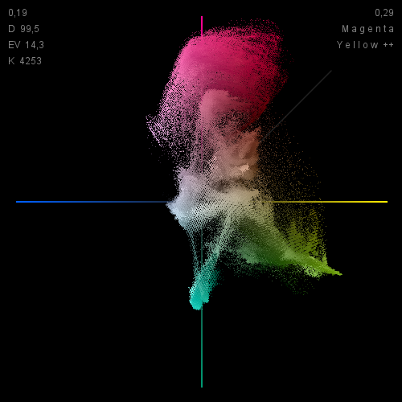

# Scope64

Un vectorscope LAB temps réel et ultra-léger pour la photographie et l'étalonnage vidéo.

Site Web : https://scope64.io

Github : https://github.com/Scope64/LAB-Vectorscope



## C'est quoi ?

Scope64 est un outil minimaliste qui affiche un vectorscope LAB en temps réel de n'importe quelle zone de l'écran. Parfait pour :

- **Balance des blancs** → Les gris neutres doivent être au centre (a=0, b=0)
- **Tons chair** → Toutes les carnations s'alignent sur la ligne à 45°, quelle que soit l'origine ethnique
- **Détection de dominante** → Visualisez instantanément les dérives Magenta/Vert ou Jaune/Bleu

## Pourquoi le LAB ?

L'espace colorimétrique LAB sépare la luminosité de la chrominance, ce qui le rend idéal pour la correction couleur. La "skin tone line" à 45° est universelle et fonctionne pour toutes les couleurs de peau.

## Fonctionnalités

- Vectorscope temps réel (10 FPS)
- Ligne de référence tons chair (45°)
- Affichage de la plage dynamique (L* et EV)
- Estimation de la température de couleur (Kelvin)
- Indicateurs d'écrêtage (ombres/hautes lumières)
- Détection de la couleur dominante
- Export screenshot (PNG)
- Toujours au premier plan
- Multi-plateforme (Windows, macOS, Linux)
- Ultra-léger (~11 Ko)

## Prérequis

- Java 8 ou supérieur
- Télécharger et installer depuis : https://www.oracle.com/fr/java/technologies/downloads/

## Utilisation
```bash
java -jar Scope64.jar
```

1. Cliquez sur la fenêtre pour démarrer la sélection
2. Dessinez un rectangle sur n'importe quelle zone de l'écran
3. Le vectorscope se met à jour en temps réel
4. Cliquez à nouveau pour sélectionner une nouvelle zone

## Raccourcis clavier

| Touche | Action |
|--------|--------|
| **S** | Sauvegarder screenshot sur le Bureau |
| **ESC** | Quitter |
| **Clic gauche** | Nouvelle sélection |

## Informations affichées

| Position | Information |
|----------|-------------|
| Haut gauche | % d'écrêtage dans les noirs Lstar < 3 |
| Haut droite | % d'écrêtage dans les blancs Lstar > 97 |
| Gauche | Plage dynamique (D), stops EV, Temp. couleur (K) |
| Droite | Dominante couleur |

## Comment lire le vectorscope

- **Centre** = Neutre (pas de dominante)
- **Haut** = Magenta
- **Bas** = Vert
- **Droite** = Jaune
- **Gauche** = Bleu
- **Ligne 45°** = Référence tons chair

## Cas d'utilisation

### Balance des blancs
Sélectionnez une zone grise/neutre. Si les points ne sont pas centrés, votre balance des blancs doit être ajustée.

### Tons chair
Sélectionnez une zone de peau. Les points doivent s'aligner sur la ligne à 45°. S'ils dérivent vers le vert ou le magenta, ajustez votre teinte.

### Détection de dominante
Sélectionnez l'image entière. L'indicateur de couleur dominante montre dans quelle direction votre image est décalée.

## Licence

Licence MIT - Libre d'utilisation, modification et distribution.

## Auteur

Copyright (c) 1996-2026 - Olivier FABRE

Merci à Claude AI / Anthropic pour les optimisations.

Fait avec passion pour les photographes et coloristes qui comprennent la puissance du LAB.